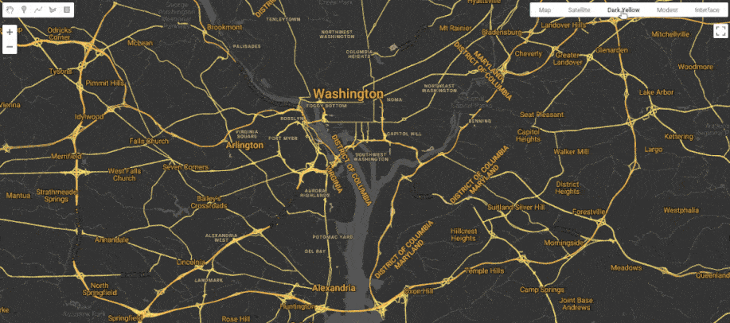

# Snazzy

[Snazzy Maps](https://snazzymaps.com) styles in the [Google Earth Engine](https://earthengine.google.com/) code editor.



## TLDR

- 🗺️ Customize your Earth Engine basemap in any script or App
- ✨ Add any style from [Snazzy Maps](https://snazzymaps.com) with one line of code
- 🗒️ Check out the [example script](https://code.earthengine.google.com/b1bfa398bbae12b6a707d2f36f3a2708) for a quick interactive demo
- ⚙️ Find `snazzy` in the [Earth Engine Developer Resources](https://developers.google.com/earth-engine/tutorials/community/developer-resources#code_editor_javascript)

## Usage

Import the `snazzy` module into your Earth Engine script.

```javascript
var snazzy = require("users/aazuspan/snazzy:styles");
```

### Add a Single Style
Add a style from [Snazzy Maps](https://snazzymaps.com/explore) to your map by copying the URL and pasting in your Earth Engine script with `snazzy.addStyle`. The second parameter is optional and will be assigned as the style alias (displayed in the top right of the map). If no alias (or `null`) is provided, the name of the style on Snazzy Maps will be used.

```javascript
snazzy.addStyle("https://snazzymaps.com/style/235815/retro", "Retro");
```

### Add Multiple Styles

Your map can have multiple custom styles at once. You can do this is by using `addStyle` multiple times, or by passing an object with URLs and aliases to `addStyles`:

```javascript
var styles = {
    "https://snazzymaps.com/style/235815/retro": "Retro",
    "https://snazzymaps.com/style/13/neutral-blue": "Blue",
    "https://snazzymaps.com/style/8097/wy": "WY"
};
snazzy.addStyles(styles);
```

### Add a Style Using a Name

You can also add a style by name rather than URL. However, there may be multiple styles with the same name. `snazzy` will always add the most popular style that matches a given name, so use a URL if selecting by name doesn't give you the style you want.

```javascript
snazzy.addStyleFromName("Retro");
```

### Add a Style Using Tags

Know the aesthetic or color scheme but don't have a specific style in mind? You can use `snazzy.addStyleFromTags` to add a popular or random style that matches your criteria. Just pass in an array of [tags/colors](#snazzy-tags) and an alias.

```javascript
snazzy.addStyleFromTags(["yellow", "black", "two-tone"]);
```

By default, `addStyleFromTags` adds the most popular style that matches all your tags, sorted by `favorites`, but you can also sort by `views` (or `random` for a surprise).

```javascript
var tags = ["colorful", "no-labels", "simple"];
var alias = null;
var order = "random";
var printUrl = true;

snazzy.addStyleFromTags(tags, alias, order, printUrl);
```

Note that `addStyleFromTags` takes an optional `printUrl` parameter that will print a style's URL to help you find it again in the future.

### Snazzy Tags

`Snazzy` supports all of the tags and colors used by Snazzy Maps. To see them in the code editor: `print(snazzy.tags)`.

- **Tags**: `colorful, complex, dark, greyscale, light, monochrome, no-labels, simple, two-tone`
- **Colors**: `black, blue, grey, green, orange, purple, red, white, yellow`

## Acknowledgements

- [@adamkrogh](https://github.com/adamkrogh) is the creator of [Snazzy Maps](https://snazzymaps.com) 👏

- [@TC25](https://github.com/TC25) wrote [a great tutorial](https://developers.google.com/earth-engine/tutorials/community/customizing-base-map-styles) on how you can manually add Snazzy Maps styles to the Earth Engine code editor, which inspired this module. 